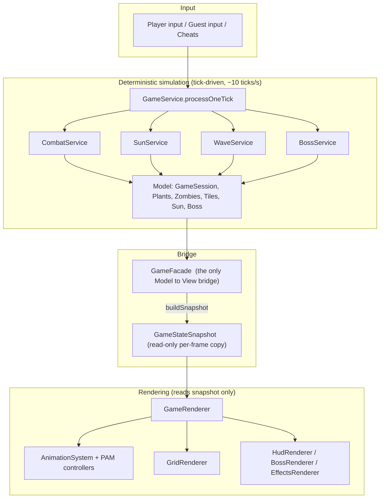

<div align="center">

# 🌻 Plants vs. Zombies — Java Edition 🧟

### A full-featured desktop remake of *Plants vs. Zombies 2* built from scratch in **Java** with **libGDX**

*Adventure chapters · animated plants & zombies · bosses · mini-games · greenhouse & shop economy · quests · and online 2-player I, Zombie*

<br/>


-lightgrey)

<br/>


</div>

---

## 📖 About the project

This project is a ground-up recreation of **Plants vs. Zombies 2** as a native desktop game.
It began as a text/console simulation of the game logic and grew into a fully graphical,
animated, and networked game. Real in-game art and skeletal **PAM** animations are used for
every plant, zombie, projectile, boss, and environment effect.

The codebase is intentionally organized around a **clean Model–View–Controller** split so the
game *logic* is completely independent of the *graphics* — the same deterministic simulation
drives both the single-player campaign and the synchronized two-player online mode.

### 👥 Team

| Name | Student ID |
|------|-----------|
| Ali Amirabadizadeh | 404105518 |
| Hamidreza Farghadani | 404106163 |
| Amir Hossein Alipour Shahr Babaki | 404106117 |

---

## 📦 Download & play (release `v1.0.0`)

Everything you need to try the game — without cloning or building anything — is attached to the
[**v1.0.0** release](https://github.com/advanced-progamming-sut-2026/phase-0-the-inheritors/releases/tag/v1.0.0). You only need **Java 25+** installed.

| File | What it is | Link |
|------|-----------|------|
| `Plant-And-Zombies-2-1.0.0.jar` | 🎮 The full game (desktop client, all assets bundled, ~475 MB) | [⬇ Download game](https://github.com/advanced-progamming-sut-2026/phase-0-the-inheritors/releases/download/v1.0.0/Plant-And-Zombies-2-1.0.0.jar) |
| `Plant-And-Zombies-2-server-1.0.0.jar` | 🌐 Multiplayer / account server (standalone, ~0.4 MB) | [⬇ Download server](https://github.com/advanced-progamming-sut-2026/phase-0-the-inheritors/releases/download/v1.0.0/Plant-And-Zombies-2-server-1.0.0.jar) |
| `Plant-And-Zombies-2-full-gameplay.mp4` | 🎬 Full walkthrough video of the game | [▶ Watch / download video](https://github.com/advanced-progamming-sut-2026/phase-0-the-inheritors/releases/download/v1.0.0/Plant-And-Zombies-2-full-gameplay.mp4) |

```bash
# 1) (optional, for online features) start the server — opens the admin dashboard, listens on 5599
java -jar Plant-And-Zombies-2-server-1.0.0.jar

# 2) start the game
java -jar Plant-And-Zombies-2-1.0.0.jar
```

> The game works fully offline (campaign, mini-games, shop, …). The server is only required for
> online accounts, the leaderboard and the 2-player *I, Zombie* mode. The server keeps its
> accounts/logs in a `data/` folder created next to the jar.

---

## 📑 Table of contents

- [Download & play (release v1.0.0)](#-download--play-release-v100)
- [Feature highlights](#-feature-highlights)
- [Screenshot tour](#-screenshot-tour)
- [Development phases](#-development-phases)
- [Architecture](#-architecture)
- [How the key systems work](#-how-the-key-systems-work)
- [Game content](#-game-content)
- [Project structure](#-project-structure)
- [Tech stack](#-tech-stack)
- [Getting started](#-getting-started)
- [Multiplayer & server](#-multiplayer--server)
- [Code quality & documentation](#-code-quality--documentation)

---

## ✨ Feature highlights

- 🌍 **Four adventure chapters** — Ancient Egypt, Frostbite Caves, Big Wave Beach, and Dark Ages, each with unique environments, hazards, and zombies.
- 🌱 **69 plants & 27+ zombies** with real idle / attack / walk / eat / death animations rendered from PAM skeletal files.
- 🧟 **Zombie special abilities** — sun-stealers, dynamite prospectors, tomb raisers, snorkels, gargantuars, jesters, pianists, and more, each with dedicated behavior and animation.
- 👑 **Zomboss battles** — a two-lane boss at the end of each chapter with a segmented health bar, stun phases, minion summons, and chapter-specific attacks (missiles, ice winds, fireballs, turbines).
- 🎮 **Mini-games** — Vasebreaker, Wall-nut Bowling, I, Zombie, plus bonus modes (Beghouled match-3 and Zombotany).
- 🗺️ **Special level types** — Conveyor Belt, Save Our Seeds, Deadline, Timed War, Love Your Plants, and Last Stand.
- 🪴 **Greenhouse, Shop & economy** — grow plants over time, buy seed packets/pots/currency, daily offers, and coins/gems/plant-food.
- 📜 **Quests & leaderboard** — daily / main / challenge quests with progress bars, plus a sortable global leaderboard.
- ✨ **Juice** — explosions, screen shake, hit flashes, falling heads/hands/armor, ashes, ice blocks, plant-food auras, and animated conveyor rails.
- 🌐 **Online 2-player I, Zombie** — host-authoritative snapshot sync, matchmaking, invite pop-ups, and in-game reactions (text, emoji, and animated GIF stickers).
- 🔐 **Accounts** — server-side registration/login, security-question password recovery, device-independent profiles, and seamless remember-me.

---

## 📸 Screenshot tour

### 🔐 Accounts & authentication

<table>
  <tr>
    <td width="50%"><p align="center"><b>Welcome</b></p></td>
    <td width="50%"><p align="center"><b>Login (online status shown)</b></p></td>
  </tr>
  <tr>
    <td width="50%"><p align="center"><b>Register</b></p></td>
    <td width="50%"><p align="center"><b>Password recovery</b></p></td>
  </tr>
</table>

### 🏠 Main hub

<table>
  <tr>
    <td width="50%"><p align="center"><b>Main menu</b></p></td>
    <td width="50%"><p align="center"><b>Profile</b></p></td>
  </tr>
  <tr>
    <td width="50%"><p align="center"><b>Settings</b></p></td>
    <td width="50%"><p align="center"><b>Leaderboard</b></p></td>
  </tr>
  <tr>
    <td width="50%"><p align="center"><b>News</b></p></td>
    <td width="50%"><p align="center"><b>Quests</b></p></td>
  </tr>
</table>

### 📚 Collection & economy

<table>
  <tr>
    <td width="50%"><p align="center"><b>Plant almanac</b></p></td>
    <td width="50%"><p align="center"><b>Plant detail (animated idle)</b></p></td>
  </tr>
  <tr>
    <td width="50%"><p align="center"><b>Zombie almanac</b></p></td>
    <td width="50%"><p align="center"><b>Zombie detail</b></p></td>
  </tr>
  <tr>
    <td width="50%"><p align="center"><b>Greenhouse</b></p></td>
    <td width="50%"><p align="center"><b>Shop</b></p></td>
  </tr>
  <tr>
    <td width="50%"><p align="center"><b>Purchase confirmation</b></p></td>
    <td width="50%"><p align="center"><b>Plant selection</b></p></td>
  </tr>
</table>

### 🎮 Playing a level

<table>
  <tr>
    <td width="50%"><p align="center"><b>Adventure / chapter select</b></p></td>
    <td width="50%"><p align="center"><b>Level objectives</b></p></td>
  </tr>
  <tr>
    <td width="50%"><p align="center"><b>Intro NPC dialogue</b></p></td>
    <td width="50%"><p align="center"><b>Loading</b></p></td>
  </tr>
  <tr>
    <td width="50%"><p align="center"><b>In-game battle</b></p></td>
    <td width="50%"><p align="center"><b>Pause menu</b></p></td>
  </tr>
</table>

---

## 🧭 Development phases

The project was delivered in progressive phases, each building on the last:

| Phase | Focus | What was built |
|:-----:|-------|----------------|
| **1** | Logic & architecture | UML design, the pure game **model** (plants, zombies, tiles, waves), core **services** (combat, sun, waves, quests), and a console simulation. |
| **2** | Graphics & GUI | libGDX rendering, all menus/screens, the **PAM animation system**, the map/grid, HUD, effects, bosses, and the four chapters with their special level types and mini-games. |
| **3** | Networking | A standalone TCP **server** (accounts, sessions, matchmaking, admin dashboard), the client **net layer**, online-first auth, profile/leaderboard sync, and **online 2-player I, Zombie** with in-game reactions. |
| **4** | Bonus & polish | Zombie special abilities across all chapters, Zomboss battles, plant-food effects, scored (MeoPoint) mode, couch co-op, and extensive visual juice. |
| **5** | Hardening | Bug-fixing, performance, and final delivery. |

---

## 🏛 Architecture

The single most important design decision is a strict separation between **simulation** and
**rendering**, connected by a one-way **snapshot pipeline**:



**Why it matters**

- 🧠 **The model never imports graphics.** All game rules live in `com.pvz2.model` / `com.pvz2.service`; the graphics layer only ever reads an immutable `GameStateSnapshot`.
- ⏸ **Pause is trivial and correct** — when paused, ticks stop *and* the render delta is zeroed, so animations freeze in place too.
- 🌐 **Multiplayer reuses the exact same engine** — one client runs the real simulation and streams snapshots; the other renders them. Both players see an identical board.
- 🔌 The `GameFacade` singleton is the *only* touch-point between the two worlds, reached through a `ServiceLocator` and `AppState`.

### Layers

```
Model  ──►  Service  ──►  Controller  ──►  GameFacade  ──►  Graphics (libGDX)
(rules)     (logic)       (commands)       (bridge)         (screens + renderers + PAM)
```

---

## ⚙️ How the key systems work

<details open>
<summary><b>🎞 PAM animation system</b></summary>

Every plant and zombie is a small **state machine** (`PlantAnimController` / `ZombieAnimController`).
Clip names and states (`IDLE`, `WALK`, `ATTACK`, `EAT`, `SPECIAL`, `DYING`, …) are **data-driven**
from [`assets/data/character_animations.json`](assets/data/character_animations.json) via
`AnimConfigLoader`, and rendered with the `libPVZ` PAM player. Multi-phase abilities use
`enter → loop → exit` clips (e.g. a sun-stealer’s *power_up → power → power_down*), and armor,
freeze, hit-flash, and health variants are layered on top.
</details>

<details>
<summary><b>🖼 The render stack</b></summary>

`GameRenderer` orchestrates, per frame and in depth order:

| Renderer | Draws |
|----------|-------|
| `GridRenderer` | Tiled background, tile overlays (graves/water/fire/ice), vases, bowling nuts, brains, lawn-mowers, and foreground props (barrel, piano, laser, tornado) |
| `AnimationSystem` | Plants, zombies, projectiles and suns via PAM, with correct Y-depth sorting and falling body parts |
| `IceBlockRenderer` | Translucent ice over frozen entities with melt stages |
| `BossRenderer` | The Zomboss, its missiles/turbines/winds and area effects |
| `EffectsRenderer` | Explosions, hit flashes, projectile sparks, plant-food auras, text pop-ups |
| `HudRenderer` | Sun counter, plant-food bank, wave progress, boss health, currencies |
</details>

<details>
<summary><b>🧟 Zombie behaviors</b></summary>

Behavior lives in the **model** — `NormalZombie.onTick` switches on zombie type and is ticked
every frame by `GameService.tickAllZombies`. Examples: **Ra** raises its staff, turns row suns
purple and drags them in over 4s; **Prospector** blasts to the front tile then reverse-walks;
**Turquoise** steals sun then fires a 4-tile laser; **Pianist** rolls a piano (destroyed before
the zombie); **Jester** deflects projectiles; **Gargantuar** throws an Imp.
</details>

<details>
<summary><b>☀️ Sun & plant-food economy</b></summary>

Sun falls from the sky and is produced by sun-plants (a collectible sun drops beside the plant
each cycle). Plant-food is stored in a HUD bank; feeding a plant plays a glowing PAM aura and
triggers a per-plant super-effect handled by `PlantFoodEffectHandler`.
</details>

<details>
<summary><b>🌐 Networking</b></summary>

A standalone TCP server (in `server/`, **built with plain `javac` — no Gradle**) handles
length-prefixed JSON packets over a shared protocol (`shared/`). It stores accounts, issues
session tokens, runs matchmaking, and relays the host’s snapshots to the guest for I, Zombie.
The client’s `NetClient` runs a dedicated reader thread and drains events onto the render thread.
</details>

---

## 🕹 Game content

- **Chapters:** Ancient Egypt · Frostbite Caves · Big Wave Beach · Dark Ages — each with its own background, tiles, hazards, zombie roster, and Zomboss.
- **Level types:** Normal · Conveyor Belt · Save Our Seeds · Deadline · Timed War · Love Your Plants · Last Stand (*Plant What You Get*).
- **Mini-games:** Vasebreaker · Wall-nut Bowling · I, Zombie · Beghouled (match-3) · Zombotany.
- **Bosses:** a chapter-specific two-lane Zomboss with a 3-segment health bar, stun windows, and minion summons.
- **Reference data:** plant/zombie/quest stats live in [`assets/data/`](assets/data) and are documented in [`documant-and-files/AP project phase2.md`](documant-and-files/AP%20project%20phase2.md).

---

## 📂 Project structure

```
Plant-And-Zombies-2/
├── core/                     # Game logic + libGDX graphics (the main module)
│   └── src/main/java/com/pvz2/
│       ├── model/            # Pure model — no graphics (plants, zombies, tiles, waves, sun, boss)
│       ├── service/          # Game logic (combat, sun, waves, quests, boss, greenhouse, scored)
│       ├── controller/       # Command controllers
│       ├── repository/       # User persistence
│       ├── graphics/         # Screens, renderers, actors, assets, net client  (libGDX)
│       ├── view/game/anim/   # PAM animation system (controllers, config, actions)
│       └── map/              # Tiled map loading, coordinates, zones
├── lwjgl3/                   # Desktop launcher (LWJGL3 backend)
├── server/                   # Standalone TCP server (no Gradle — javac + scripts)
├── shared/                   # Network protocol shared by client & server
├── assets/                   # Art, audio, maps, PAM animations, JSON data, GIFs
├── documant-and-files/       # Design docs, phase specs, UI screenshots
├── run-client.bat            # Launch a single client
├── run-2p.bat                # Launch two clients for local 2-player testing
└── server/run.bat            # Launch the server
```

---

## 🧰 Tech stack

- **Language:** Java 25
- **Game framework:** libGDX (LWJGL3 desktop backend)
- **UI:** scene2d + a custom `pvz-skin`
- **Animation:** `libPVZ` PAM skeletal renderer, driven by JSON config
- **Maps:** Tiled (`.tmx`)
- **Build:** Gradle (client) · plain `javac` (server)
- **Networking:** TCP sockets, length-prefixed JSON frames, Gson
- **Quality:** Checkstyle + PMD, Javadoc across the codebase

---

## 🚀 Getting started

### Prerequisites

- **JDK 25** (or newer) on your `PATH`.
- No manual Gradle install needed — the included `gradlew` wrapper handles it.

### Run the game (single player)

```bash
# Windows
run-client.bat
```

or with Gradle directly:

```bash
./gradlew :lwjgl3:run
```

### Build the runnable jars yourself

Prebuilt jars are attached to the [`v1.0.0` release](https://github.com/advanced-progamming-sut-2026/phase-0-the-inheritors/releases/tag/v1.0.0) — see
[Download & play](#-download--play-release-v100). To rebuild them from source:

```bash
# Game client (fat jar with all assets) → lwjgl3/build/libs/Plant-And-Zombies-2-1.0.0.jar
./gradlew :lwjgl3:jar
```

```bash
# Server (plain javac, no Gradle) → Plant-And-Zombies-2-server-1.0.0.jar
cd server
build.bat                                  # or ./build.sh  → classes in server/out
cd out && jar xf ../lib/gson-2.13.1.jar && cd ..   # bundle gson into the jar
jar cfe Plant-And-Zombies-2-server-1.0.0.jar com.pvz2.server.Main -C out .
```

### Compile-check only

```bash
./gradlew compileJava
```

> The desktop launcher’s main class is `com.pvz2.lwjgl3.Lwjgl3Launcher`.

---

## 🌐 Multiplayer & server

The **online I, Zombie** mode needs the server running. The server is fully independent of the
client’s Gradle build.

```bash
# 1) Start the server — either the prebuilt jar from the release …
java -jar Plant-And-Zombies-2-server-1.0.0.jar      # listens on port 5599 by default

# … or build & run it from source
cd server
build.bat        # or ./build.sh
run.bat          # or ./run.sh

# 2) Launch two clients (for local testing)
run-2p.bat
```

Then, from two accounts: open the multiplayer lobby, invite by username (or use random
matchmaking), and one player controls the plants while the other places zombies. During the
match you can send **text, emoji, and animated GIF reactions** that appear in the opponent’s
corner. A Swing **admin dashboard** shows connected users, live logs, and lets you broadcast news.

---

## 🧹 Code quality & documentation

The team follows a shared set of conventions to keep the codebase consistent:

- **Git flow:** feature work on branches, small scoped commits, and a linear history merged into `main`.
- **Commit format:** `[scope] type: subject` (e.g. `[render] add: boss and ice-block renderers`).
- **Docs:** Javadoc on public types/methods and explanatory comments for non-obvious logic.
- **Static analysis:** Checkstyle + PMD are run before merging to `main`.

Detailed design notes, the full phase-2 evaluation breakdown (with per-feature code references),
and the plant/zombie/quest reference tables are kept in
[`documant-and-files/`](documant-and-files).

---

<div align="center">

*Built with ☀️ and 🧠 — a semester-long journey from a console simulation to a fully animated, networked game.*

</div>
